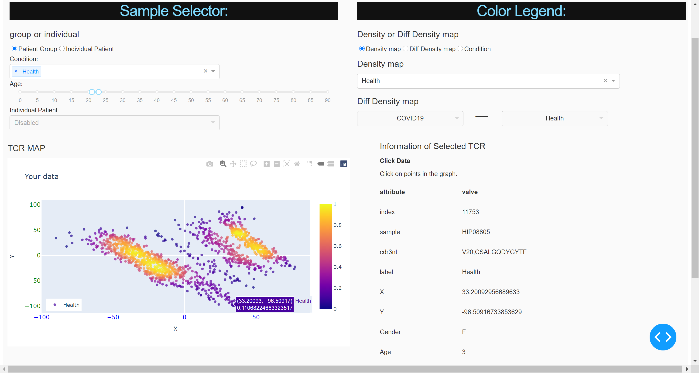

# TCR Map: Location Is All We Need

Yuqing Chang (1), Shun Wang (1), Yacheng Liu (1), Hao Li (1), Wenxian Yang (2), Rongshan Yu (1,2)

(1) Department of Computer Science, Xiamen University, China 

(2) Aginome Scientific, China



## 1. Introduction

T cells are the effectors of cell-mediated adaptive immunity in jawed vertebrates. The responding T cell proliferates clonally, and its progeny inherit the same antigen-specific T cell receptors (TCR), constituting a long-term immunological memory of the antigen. The diverse population of TCR clones in an individual (the TCR repertoire) thus dynamically encodes a history of immunological challenges. People have similar virus-specific TCR after being exposed to the same virus, such as parvovirus, influenza, cytomegalovirus, and Epstein-Barr virus [1].

Currently, high-throughput TCR sequencing allows us to charactrize individuals' TCR repertoires. However, it remains as a non-trivial task to associate these sequenced TCRs to their antigenic targets directly from TCR repertoire data, hence limiting the utilization of these data in immunlogical and clinical research.  In this project, we developed a method to map TCR repertoire data into a low-dimensional embedded space. The resulting embedded respresentation of TCR repertoire data, which we referred to as TCR Map, preserves the similarities of different TCR moleculars such that similar TCRs will be placed closely in the embedded space.   

The TCR Map tool can be utilzed in several different ways to help biological study of TCR repertoire data. For example, as TCRs of same or similar antigens tend to cluster together in the TCR Map, one can try to infer the potential epitope targets of an unknown TCR with its surrounding annotated TCR. Furthermore, one can try to fit a probability density function based on aggregation degree of TCRs from different patient groups (e.g., COVID-19 vs non-COVID-19) on the TCR Map, and identify potential disease-specific TCR clusters based on their differentiation.  In this App-a-thon competition, we developed a software pipeline and a (preliminary) interactive tool based on Python/Plotly to facilitate these analysis. 

## 2. Methods

### Data

TCR-beta sequences datasets of COVID-19 patients were downloaded from ImmuneCODE-COVID available from [precisionFDA's COVID-19 Precision Immunology App-a-thon](https://precision.fda.gov/challenges/12) , which consists of 1486 samples from of 7 cohorts in total. Within these samples, 928 COVID-positive samples were selected in our demo. We also used a CMV TCR-beta sequencing dataset (340 CMV+ and 419 normal/healthy samples) for control [4]. In our demo, there are 1687 samples in total. 

### Identifying amplified TCR chains
In our project, TCR chains were defined by a V-gene family plus a CDR3 amino acid sequence. 

To reduce the amount of TCRs in our processing pipeline, we only keep only potentially amplified TCRs of each samples in our analysis, which was done as follows: 

1. Calculate the TCR generation probability [2] using [pgen](https://github.com/phbradley/pubtcrs). This value is taken as the TCR generation probability within healthy people. 

2. Since low generation probability of TCRs, p-values indicating clonality expeditions can be calculated using Poisson model. Among one sample, the expectation clonality of a particular TCR can be assumed using TOTAL_TCR_CLONALITY * PGen, which was the lambda parameter of Poisson model; then the probability of observed or more clonality of this TCR can be calculated using R function ppois. TCRs with p-values less than 1e-30 were considered as amplified TCRs. Amplified TCRs were sorted by clonality number in decreasing order, and amplified TCRs ranked within top 1/5000 of total clonal types of each sample were reserved for further analysis. In total 66648 TCRs were selected from all samples.

### TCR similarity calculation
Similarity levels of each pairs of selected TCR chains were calculated using TCRdist method [3] (downloaded from [github](https://github.com/phbradley/pubtcrs) to generate a distance matrix D of the TCR chains.


### TCR dimension scaling and visualization

<!-- TCR经过过滤后，得到TCR之间的距离矩阵D，为了可视化TCR的分布。我们利用MDS(Multidimensional Scaling) 算法，得到TCR在二维平面的坐标。
MDS，是一种有效的降维方法，MDS使高维空间中每对样本之间的距离与构建的低维空间中的样本相似性尽可能一致。 -->

For translating the TCR chains into a low dimension embedded space (in our case two domension for visualziation), we applied the multidimensional scaling (MDS) algorithm [5] to the distance matrix D, which places each TCR into the 2D space such that the pairwise similarity among TCRs are preserved as Euclidean distance in the embedded space as much as possible. 

### Probability density fitting

After MDS, each TCR chain is represented as a point in the 2D embedded space. We then used Parzen-Window Density Estimation (PWDE) algorithm to fit probability density functions on TCRs of different patient groups to reveal their locational preference in the 2D embedded space (TCR Map). 

In our demo we choose the Gaussian Kernel assuming that the data points are i.i.d. random variables with known probability distribution functions. 

## 3. Usage

### Quick start 

To facilitate the evalution of TCR Map, we encapsulated the visualization tool together with all the preprocessed data from ImmuneCODE-COVID and CMV TCR-beta sequencing dataset into a docker file, which can be launched using the following command: 
```
docker run -d -p 8050:8050 wangshun1121/tcrmap:0.1
```
After the tool is running, enter `127.0.0.1:8050` in your web browser to access to the TCR Map tool. 

You may now proceed to the visualization section for the instructions of the interactive web interface. Or, check the data prepration section if you want to prepare your own dataset for visualization. 
### Data preparation 
#### TCR distance calculation 
To produce the TCR distance data, follow the following steps

* Obtain TCR data 
* Identified amplified TCR chains as in https://github.com/wangshun1121/pubtcrs. 
* Put the selected TCRs with their corresponding samples recorded in `SelectedTCRs.xls.gz`, and the selected samples with their phenotypes (age, gender and disease) in `Phenotypes.txt`.
* Finally, use the following commands to produce the TCR distance data for subsequent steps. 

```
cut 1,4 Phenotypes.txt > COVID.Status.txt 
gunzip -c SelectedTCRs.xls.gz | cut -f 4 | grep -v "V_CDR3" | sort | uniq >SelectedTCRs.csv # Ready for TCR similarity distance calculation
# export pubtcrs=/where/pubtcrs/tools/are # Path to pubtcrs
$pubtcrs/bin/tcrdists -i SelectedTCR.csv -d $pubtcrs//db |sed "s/\ /\t/g"|cut -f 4-  SelectedTCR.tcrdist.tab # TCR distance, this file can be huge!!! And running this command may takes one day or even more time!
```
#### Obtain TCR coordinates
To obtain the two-dimensional coordinates of TCR,follow the following steps:

* Obtain TCR distance matrix from SelectedTCR.tcrdist.tab
* Obtain TCR sequence and vdj message from SelectedTCRs.csv  
* Obtain sample message from SelectedTCRs.xls
```
gunzip ./SelectedTCRs.xls.gz
```
* Obtain status from COVID.Status.txt
* Finally, using the following commands to produce the TCR coordinate for subsequent steps.
```
python calc_tcr_coord.py --tcr_dist_path ./SelectedTCR.tcrdist.tab --filter_tcr_path ./SelectedTCRs.csv --selected_tcr_path ./SelectedTCRs.xls --status_path ./COVID.Status.txt --save_path output_path
```
### Visualization
A user can interact with the TCR Map tool via two control modules, i.e., the Sample Selector and the Color Legend. 

The Sample Selector is used to select TCR from an individal sample or from a group of samples for visualization. More specifically, a user can select TCRs from people of different conditions or age groups to be visualized on the TCR Map.  Alternatively, a user can also select TCRs from a list of individual people from a drop-down list. Sample selection based on other clinical attribute (e.g. severity of disease) is currently under development as well.   

For the Color Legend, a user can select several density distribution functions estimated from locational distribution of TCRs from different groups (COVID-19, CMV, and healty) as color legend to annotate the TCRs display on the TCR Map, which reveals the density of TCRs from different groups in the surroundings of the displayed TCRs. Furthermore, a user can also select the difference between two different probability distribution densities to discover potential enrichment of TCRs related to certain disease in certain locations on the TCR Map. 


## References

- [1] DeWitt III W S, Smith A, Schoch G, et al. Human T cell receptor occurrence patterns encode immune history, genetic background, and receptor specificity[J]. Elife, 2018, 7: e38358. 
- [2] Murugan A, Mora T, Walczak A M, et al. Statistical inference of the generation probability of T-cell receptors from sequence repertoires[J]. Proceedings of the National Academy of Sciences, 2012, 109(40): 16161-16166. 
- [3] Dash P, Fiore-Gartland A J, Hertz T, et al. Quantifiable predictive features define epitope-specific T cell receptor repertoires[J]. Nature, 2017, 547(7661): 89-93. 
- [4] Emerson R O, DeWitt W S, Vignali M, et al. Immunosequencing identifies signatures of cytomegalovirus exposure history and HLA-mediated effects on the T cell repertoire[J]. Nature genetics, 2017, 49(5): 659-665.
- [5] Borg, I.; Groenen, P. (2005). Modern Multidimensional Scaling: theory and applications (2nd ed.). New York: Springer-Verlag. pp. 207–212.
